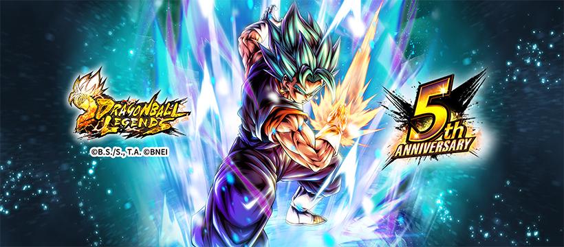

[license-img]: https://img.shields.io/badge/License-MIT-white.svg
# ZenkApi v1.1.0
![license-img][]



Unofficial API for Dragon Ball Legends Characters

#### This is the python port of [DBLegendsAPI](https://github.com/feijoes/DBlegendsAPI) by [feijoes](https://github.com/feijoes)

## Requirements

```shell
pip install -r requirements.txt
```

## Usage

1. Go to scraper folder and run main.py to scrape data from the website

```shell
python main.py
```

2. In the root folder of the project run the main.py to start the server

```shell
python main.py
```

## Routes

Route | Description | Example
------|-------------|--------
characters | Get all characters ( default limit is 2 ) | ```zenkapi/v1/characters```

#### Parameters

| Parameter | Type | Description | Example 
| --------- | ---- | ----------- | ------- 
| name | str | Name of the character | ```zenkapi/characters?name=Zamasu``` returns all characters that have the name Zamasu
| contains | str | String that is in the name | ```zenkapi/characters?contains=Super%20Saiyan``` returns all characters that have Super Saiyan in their name
| id | str | ID of the character | ```zenkapi/characters?id=DBL58-01S``` returns the character with ID DBL58-01S
| has_zenkai | bool | If the character has a Zenkai | ```zenkapi/characters?has_zenkai=true``` returns all characters that have Zenkai
| is_lf | bool | If the character is a Legends Limited unit | ```zenkapi/characters?is_lf=true``` returns all characters that are Legends Limited
| is_tag | bool | If the character is a tag unit | ```zenkapi/characters?is_tag=true``` returns all characters that are tag units
| color | str | Color of the character | ```zenkapi/characters?color=BLU,PUR``` returns all characters with the color Blue or Purple
| rarity | str | Rarity of the character | ```zenkapi/characters?rarity=ULTRA,SPARKING``` returns all characters with the rarity Ultra or Sparking
| tags | str | Tags of the character | ```zenkapi/characters?tags=God%20Ki,Fusion%20Warrior``` returns all characters with the tag God Ki and Fusion Warrior
| limit | int | Limit of the results ( limit is 2 if not specified ) | ```zenkapi/characters?limit=10``` returns the first 10 characters

### Example data

```json
[
    {
        "name": "Super Saiyan God SS Vegito",
        "id": "DBL61-01U",
        "color": "RED",
        "rarity": "ULTRA",
        "tags": [
            "Saiyan",
            "Future",
            "Potara",
            "Fusion Warrior",
            "God Ki",
            "Super Saiyan God SS",
            "Male",
            "ULTRA",
            "Melee Type",
            "RED",
            "\"Future\" Trunks Saga (S)",
            "Vegito",
            "DBL61-01U",
            "Armored Strike Arts",
            "Healer",
            "Counter",
            "Ultimate Arts",
            "Special Cover Change (Strike)",
            "Special Cover Change Nullification",
            "Unfavorable Element Factor Nullification",
            "Unique Gauge",
            "Arts Action"
        ],
        "main_ability": {
            "name": "Not if I stop you!",
            "effect": "Randomly destroys 1 of your own cards and draws the Ultimate Arts Card \"Maximum Impact Rush\" next. Restores own health by 30% and Ki by 50. Cancels own Attribute Downgrades and Abnormal Conditions. Applies Attribute Upgrade \"-50% to enemy's 'Sustained Damage CUT' effects\" to self for 15 timer counts.  Requirements: 20 timer counts must elapse."
        },
        "unique_ability": {
            "start_abilities": [
                {
                    "ability_name": "Blue Beacon to Quell Despair",
                    "ability_effect": "Applies the following effects to self when battle starts:  +150% to damage inflicted (cannot be cancelled). +30% to Strike damage inflicted (cannot be cancelled). Reduces damage received by 70% (cannot be cancelled). Increases Arts Card Draw Speed by 1 level (cannot be cancelled). Increases Arts Card Draw Speed by 1 level for 30 timer counts. -5 to Arts costs (cannot be cancelled). Applies Buff Effect \"Nullifies enemy's 'Reduce Dragon Balls' effects\" for 60 timer counts (cannot be cancelled). Applies Buff Effect \"Nullifies enemy's 'Destroy Card' effects\" for 30 timer counts.  The following effects occur when this character enters the battlefield:  Draw a Strike Arts Card next. +20% to own Ki Recovery for 15 timer counts. Applies Buff Effect \"Nullifies enemy's special actions that activate when changing cover\" to self for 5 timer counts. Seals enemy's Rising Rush for 5 timer counts. Reduces enemy Vanishing Gauge to 0% (activates once).  Also cancels allies' Attribute Downgrades and Abnormal Conditions if there are 3 enemy battle members remaining.  The following effects occur every time when faced with an enemy:  Restores own Ki by 30. Inflicts enemy with Attribute Downgrade \"-15% to Critical Rate\" for 15 timer counts. Seals enemy's Special Move Arts. The sealed Arts cannot be used for 3 timer counts.  Applies the following effects to self if own remaining health is 50% or below after being hit by an enemy's Arts attack while this character is on the battlefield (activates once):  Restores health by 30%. Nullifies unfavorable Element factors for damage sustained for 30 timer counts. Increases Dragon Balls by 1. Cancels Attribute Downgrades and Abnormal Conditions."
                },
                {
                    "ability_name": "Fusion to Right the Future",
                    "ability_effect": "Knocks enemy back to long range if a cover change is performed against their Strike Arts attack (activates during assists).  [Comboable Arts] Special Move Arts  Charges own Unique Gauge every time this character uses an Arts Card while they are on the battlefield. Once the Unique Gauge is full, it resets to zero and applies the following effects to self:  Draw a Strike Arts Card next. Restores health by 10% and Ki by 50. +30% to damage inflicted for 15 timer counts (cannot be cancelled). +40% to Ki Recovery for 15 timer counts (cannot be cancelled). Applies Buff Effect \"Nullifies enemy's special actions that activate when changing cover\" for 5 timer counts.  Applies the following effects to self when this character activates Rising Rush:  Increases Dragon Balls by 1. +40% to Ki Recovery (cannot be cancelled). Nullifies unfavorable Element factors for 10 timer counts (cannot be cancelled). Nullifies enemy's \"Restores health when it reaches 0\" effects when this character attacks for 3 timer counts.  The following effects occur when this character defeats an enemy:  Restores own Vanishing Gauge by 100%. Restores ally health by 10%."
                }
            ],
            "zenkai_abilities": null
        },
        "ultra_ability": {
            "name": "Resonance of Force (Fusion Warrior)",
            "effect": "If this character is the Leader, applies the following effects to self when battle starts:  +30% to damage inflicted (cannot be cancelled). +30% to Ki Recovery (cannot be cancelled).  If this character is not the Leader, applies the following effects to self per \"Tag: Fusion Warrior\" battle/support member when battle starts:  +5% to damage inflicted (cannot be cancelled). +5% to Ki Recovery (cannot be cancelled).  *Up to 3 support members will be counted."
        },
        "base_stats": {
            "power": 10494,
            "health": 26077,
            "strike_atk": 2724,
            "strike_def": 1685,
            "blast_atk": 2570,
            "blast_def": 1719
        },
        "max_stats": {
            "power": 928577,
            "health": 1592975,
            "strike_atk": 166409,
            "strike_def": 102921,
            "blast_atk": 157012,
            "blast_def": 104987
        },
        "strike": "Strike (Impact) Inflicts enemy with Attribute Downgrade \"+10% to Damage Received\" for 15 timer counts on hit. *Blast Armor when charging forward.",
        "shot": "Blast (Impact) Restores own Ki by 5 upon activation.",
        "image_url": "https://i.imgur.com/jca3NbC.png",
        "special_move": {
            "name": "Final Spirit Slash",
            "effect": "Deals massive Slice damage. +30% to Special Move damage inflicted for 3 timer counts upon activation. 100% chance to inflict Extreme Bleed on hit.  *Blast Armor when charging forward."
        },
        "special_skill": {
            "name": "Versatile Counter",
            "effect": "The following effects occur upon activation:  Restores own health by 15%. Nullifies own unfavorable Element factors for 10 timer counts (cannot be cancelled). Seals enemy's Rising Rush for 5 timer counts.  Counter will activate upon enemy's Tap Actions, Strike Arts, or Blast Arts while in fighting pose. The following effects occur when counter activates:  Randomly destroys 1 of your own cards and draws a Special Move Arts Card next (activates once). Restores own Ki by 50. Inflicts enemy with Attribute Downgrade \"-100% to Health Restoration\" for 10 timer counts.  [Comboable Arts] Special Move Arts Ultimate Arts"
        },
        "ultimate_skill": {
            "name": "Maximum Impact Rush",
            "effect": "Deals supreme Impact damage. Applies the following effects to self upon activation:  +20% to Ultimate damage inflicted for 3 timer counts. Nullifies enemy's \"Restores health when it reaches 0\" effects when this character attacks for 3 timer counts.  A portion of the damage inflicted will also be dealt to enemy members on standby on hit (this cannot cause them to be defeated).  Activates an Arts Action on hit. The following effects occur if the button is pressed enough times during the time limit:  Increases damage. Destroys all of your enemy's cards.  *Blast Armor when charging forward."
        },
        "z_ability": {
            "one": {
                "tags": [
                    "Fusion Warrior"
                ],
                "effect": "+28% to \"Tag: Fusion Warrior\" base Strike Attack & Defense during battle."
            },
            "two": {
                "tags": [
                    "Future",
                    "Fusion Warrior"
                ],
                "effect": "+30% to \"Tag: Fusion Warrior\" or \"Tag: Future\" base Strike Attack & Defense during battle."
            },
            "three": {
                "tags": [
                    "Future",
                    "Fusion Warrior"
                ],
                "effect": "+3% to Ultimate damage inflicted by \"Tag: Fusion Warrior\" and +38% to \"Tag: Fusion Warrior\" or \"Tag: Future\" base Strike Attack & Defense during battle."
            },
            "four": {
                "tags": [
                    "Future",
                    "Fusion Warrior"
                ],
                "effect": "+5% to Ultimate damage inflicted by \"Tag: Fusion Warrior\" and +42% to \"Tag: Fusion Warrior\" or \"Tag: Future\" base Strike Attack & Defense during battle."
            }
        },
        "is_lf": false,
        "is_tag": false,
        "has_zenkai": false
    }
]
```

Note: Currently all tag units are marked as false, this will be fixed when the API is updated

## Goals
- Implementation for getting data of transformed characters
- Implementation for getting data of tag units
- Implementation for getting sorted data

## License

[MIT License](LICENSE)